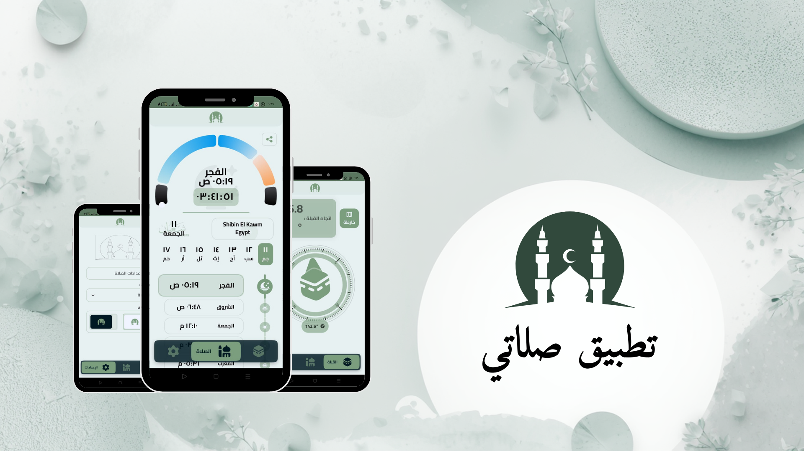

<div align="center">
  

# 🕌 الصَّلَاةَ — Salaty

**رفيقك المسلم المتكامل | Your Complete Muslim Companion**

[](https://flutter.dev)
[](https://pub.dev/packages/get)
[](https://dart.dev)
[]()

  <p>
    <a href="#-about-the-app">نبذة</a> •
    <a href="#-key-features">المميزات</a> •
    <a href="#%EF%B8%8F-tech-stack">التقنيات</a> •
    <a href="#%EF%B8%8F-installation">التثبيت</a>
  </p>
</div>

---

<div align="center">
  
</div>

<br />

<table>
  <tr>
    <td dir="rtl" align="right" width="50%" valign="top">
      <h3>📖 نبذة عن التطبيق</h3>
      <p>
        تطبيق <strong>الصَّلَاةَ (Salaty)</strong> هو تطبيق إسلامي شامل صُمم بعناية فائقة ليجمع بين دقة الحسابات الفلكية وجمال التصميم. 
        يهدف التطبيق إلى تيسير حياة المسلم اليومية من خلال تقديم مواقيت الصلاة بدقة، اتجاه القبلة، التقويم الهجري، وميزة تعليم الصلاة، 
        كل ذلك في واجهة تفاعلية عصرية تدعم الوضعين الداكن والفاتح.
      </p>
    </td>
    <td align="left" width="50%" valign="top">
      <h3>📖 About The App</h3>
      <p>
        <strong>Salaty</strong> is a comprehensive Islamic application crafted with precision and elegance. 
        It integrates accurate prayer times, Qibla direction, Hijri calendar, and prayer learning guides into a modern, 
        interactive interface heavily focused on User Experience (UX), supporting both Dark and Light modes.
      </p>
    </td>
  </tr>
</table>

---

## 🚀 المميزات الرئيسية | Key Features

|                   الميزة (Arabic)                   |                     Feature (English)                      |
| :-------------------------------------------------: | :--------------------------------------------------------: |
|    **مواقيت دقيقة** ⏱️<br>حساب تلقائي حسب الموقع    | **Accurate Times** ⏱️<br>Auto-calculated based on location |
|        **القبلة** 🕋<br>بوصلة تفاعلية دقيقة         |    **Qibla Finder** 🕋<br>Interactive & precise compass    |
|        **التقويم** 📅<br>هجري وميلادي متزامن        |         **Calendar** 📅<br>Hijri & Gregorian sync          |
|     **تعليم الصلاة** 🤲<br>دليل مصور للمبتدئين      |        **Prayer Guide** 🤲<br>Step-by-step learning        |
|       **التنبيهات** 🔔<br>أذان وإشعارات مخصصة       |     **Notifications** 🔔<br>Customizable Adhan alerts      |
|      **الويدجت** 📱<br>متابعة سريعة من الشاشة       |         **Widgets** 📱<br>Home screen integration          |
| **متعدد اللغات** 🌍<br>دعم كامل للعربية والإنجليزية |    **Localization** 🌍<br>Full Arabic & English support    |

---

## 🛠️ التقنيات المستخدمة | Tech Stack

<div align="center">

| Category             | Package/Tech                                                          |
| :------------------- | :-------------------------------------------------------------------- |
| **Framework**        |  |
| **State Management** |                     |
| **Networking**       |                          |
| **Maps & Location**  | `geolocator`, `flutter_map`                                           |
| **Calculations**     | `adhan`, `hijri_date`                                                 |
| **Local Storage**    | `get_storage`                                                         |
| **UI Components**    | `flutter_svg`, `lottie`                                               |

</div>

---

## 🏗️ التثبيت والتشغيل | Installation

<div align="center">

```bash
# 1. Clone the repository
git clone https://github.com/username/salaty_app.git

# 2. Navigate to directory
cd salaty_app

# 3. Install dependencies
flutter pub get

# 4. Run the app
flutter run
```

</div>

---

<p align="center">
  Done with ❤️ using Flutter
</p>
